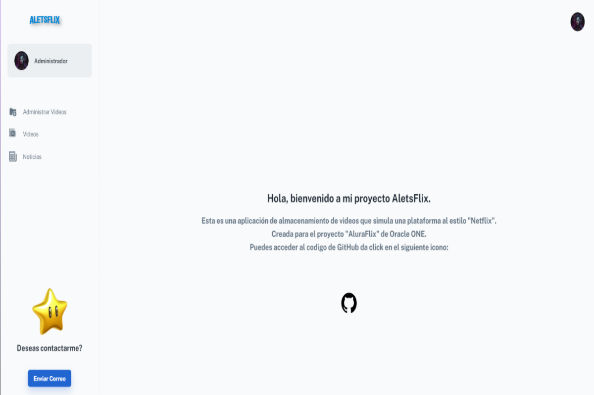
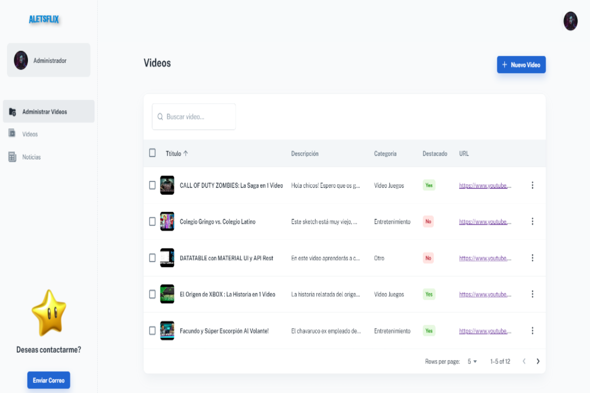
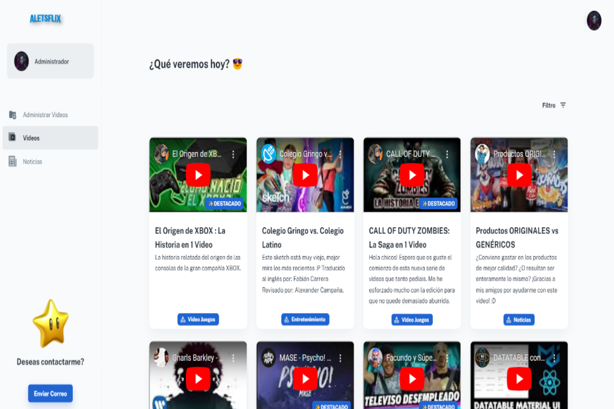
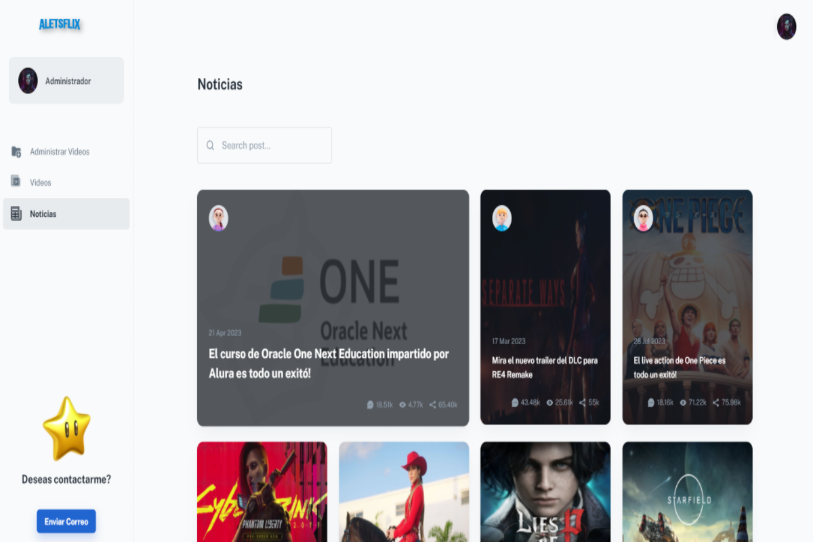

# Challenge ONE | Challenge React - Aluraflix

### Pantalla inicial:

     

### Sección para agregar, editaer y eliminar videos:

     

### Pantalla que muestra los videos que existen y permite filtrarlos:

     

### Pantalla de muestra (Noticias):

     

### Si te gusto agradecería si:

#### Marca este proyecto con una estrella ⭐
#### Sigueme en GitHub ❤️
---

## ¿Cómo descargar el repositorio?
---
Para descargar el archivo: Puede hacer clic en el botón verde con el nombre "Code" en la parte superior derecha y luego Descargar zip/Download zip. Luego puede abrir el archivo en su editor preferido 

     

